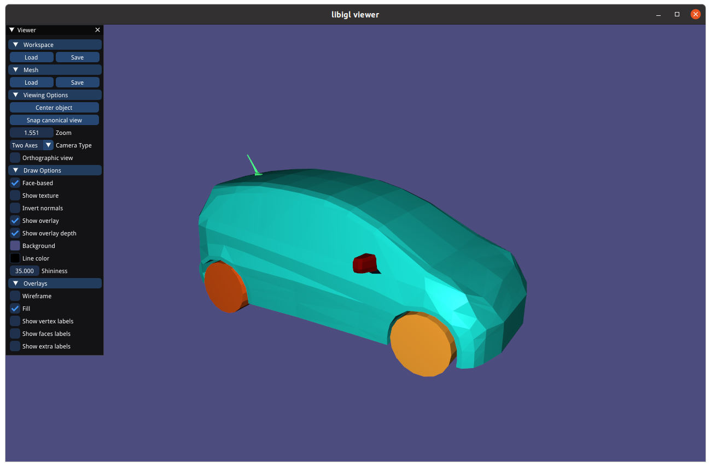
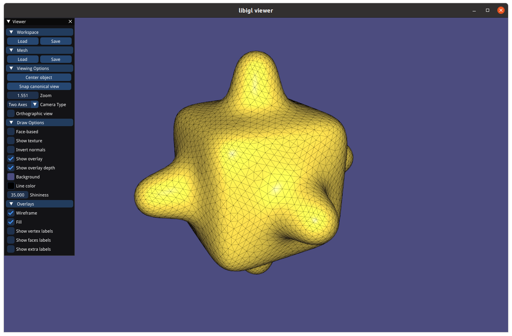

# Assignment 1
Name: François Costa

Legi-Nr: 19-931-989

## Required results
Edit this 'README.md' file to report all your results. You only need to update the tables in the reports section by adding screenshots and reporting results.

### Tasks
- Add a text dump of the content of the two data structures for the provided mesh “plane.off”.

- Show three screenshots of the 'fandisk.off' model using 'per-face shading', 'per-vertex shading' and 'per-corner shading'. Describe the difference between them.

- Show screenshots of the provided meshes with each connected component colored differently. Show the number of connected components and the size of each component (measured in number of faces) for all the provided models.

- Show screenshots of the subdivided meshes.

## Reports
### text dump of the data structure for "plane.off"
| Vertices-to-Face               | Vertices-to-Vertex  |
|:-------------------------------|:------------------- |
| [Dump](#Vertices-to-face-dump) | [Dump](#Vertices-to-vertices-dump) |

#### Vertices-to-face-dump

| Vertex               | Faces                |
|:---------------------|:---------------------|
| Vertex : 0 | Connected faces : 5 21  |
| Vertex : 1 | Connected faces : 31  |
| Vertex : 2 | Connected faces : 10 26  |
| Vertex : 3 | Connected faces : 0  |
| Vertex : 4 | Connected faces : 14 27 30  |
| Vertex : 5 | Connected faces : 13 23 29  |
| Vertex : 6 | Connected faces : 1 4 17  |
| Vertex : 7 | Connected faces : 2 8 18  |
| Vertex : 8 | Connected faces : 6 9 12 19 22 25  |
| Vertex : 9 | Connected faces : 15 30 31  |
| Vertex : 10 | Connected faces : 11 26 27  |
| Vertex : 11 | Connected faces : 7 21 23  |
| Vertex : 12 | Connected faces : 15 29 31  |
| Vertex : 13 | Connected faces : 4 5 20  |
| Vertex : 14 | Connected faces : 0 1 16  |
| Vertex : 15 | Connected faces : 8 10 24  |
| Vertex : 16 | Connected faces : 0 2 16  |
| Vertex : 17 | Connected faces : 3 8 9 18 19 24  |
| Vertex : 18 | Connected faces : 3 4 6 17 19 20  |
| Vertex : 19 | Connected faces : 7 12 13 22 23 28  |
| Vertex : 20 | Connected faces : 11 12 14 25 27 28  |
| Vertex : 21 | Connected faces : 1 2 3 16 17 18  |
| Vertex : 22 | Connected faces : 5 6 7 20 21 22  |
| Vertex : 23 | Connected faces : 9 10 11 24 25 26  |
| Vertex : 24 | Connected faces : 13 14 15 28 29 30  |

#### Vertices-to-vertices-dump

| Vertex               | Vertices                               |
|:---------------------|:---------------------------------------|
| Vertex : 0 | Connected vertices : 11 13 22          |
| Vertex : 1 | Connected vertices : 9 12              |
| Vertex : 2 | Connected vertices : 10 15 23          |
| Vertex : 3 | Connected vertices : 14 16             |
| Vertex : 4 | Connected vertices : 9 10 20 24        |
| Vertex : 5 | Connected vertices : 11 12 19 24       |
| Vertex : 6 | Connected vertices : 13 14 18 21       |
| Vertex : 7 | Connected vertices : 15 16 17 21       |
| Vertex : 8 | Connected vertices : 17 18 19 20 22 23 |
| Vertex : 9 | Connected vertices : 1 4 12 24         |
| Vertex : 10 | Connected vertices : 2 4 20 23         |
| Vertex : 11 | Connected vertices : 0 5 19 22         |
| Vertex : 12 | Connected vertices : 1 5 9 24          |
| Vertex : 13 | Connected vertices : 0 6 18 22         |
| Vertex : 14 | Connected vertices : 3 6 16 21         |
| Vertex : 15 | Connected vertices : 2 7 17 23         |
| Vertex : 16 | Connected vertices : 3 7 14 21         |
| Vertex : 17 | Connected vertices : 7 8 15 18 21 23   |
| Vertex : 18 | Connected vertices : 6 8 13 17 21 22   |
| Vertex : 19 | Connected vertices : 5 8 11 20 22 24   |
| Vertex : 20 | Connected vertices : 4 8 10 19 23 24   |
| Vertex : 21 | Connected vertices : 6 7 14 16 17 18   |
| Vertex : 22 | Connected vertices : 0 8 11 13 18 19   |
| Vertex : 23 | Connected vertices : 2 8 10 15 17 20   |
| Vertex : 24 | Connected vertices : 4 5 9 12 19 20    |

#### Show three screenshots of the 'fandisk.off' model using different shading. Make sure you disable the wireframe and that the screenshots clearly show the differences between the different shading types.
| model name | per-face shading                                               | per-vertex shading                                                 | per-corner shading (threshold value 85 in this example)                |
|:----------:|----------------------------------------------------------------|--------------------------------------------------------------------|------------------------------------------------------------------------|
|  fandisk   |  |  |  |

#### Briefly describe the difference between the different shading types.

I decided to take this shot of the object, because it shows the difference between the three techniques.

We can see between the first and the second image that the flat shading produces a visual artifact in the rounded part. In the first image, we can clearly see the variations in brightness, and the light variation is not continuous.

The technique of per vertex shading allows to remove this discontinuity by holding a normal to each vertex and then for each point in the mesh interpolate the normal value to the 3 normal vertices of the triangle and thus have a continuous variation of brightness.

The technique of per-vertex shading has however a visual artifact, we can see that the angles are rendered in a very smooth way and not sharp. By using the per-corner normal technique, we can remove this visual artifact. We can see this by comparing the cortex of the image per-vertex shading and per-corner shading.

### Assign different colors to each connected component
| model name   | your results                                                      | no. of components |            no. of faces per component            |
| :----------: |-------------------------------------------------------------------|:-----------------:|:------------------------------------------------:|
|bumpy_cube    |  |         1         |                       2496                       |
|bunny         |      |         1         |                      27864                       |
|coffeecup     |  |         2         |                    3360/2304                     |
|honda         |      |        11         | 90/192/192/13216/704/1088/1088/1088/1088/736/736 |

### Screenshots of subdivided meshes. Make sure you enable the wireframe overlay.

| model name | original shape                                                          | subdivided shape                                                         |
| :--------: |-------------------------------------------------------------------------|--------------------------------------------------------------------------| 
| plane      |       |     |
| sphere     |      |    |
| bunny      |       |     |
| bumpy_cube |  |  |

