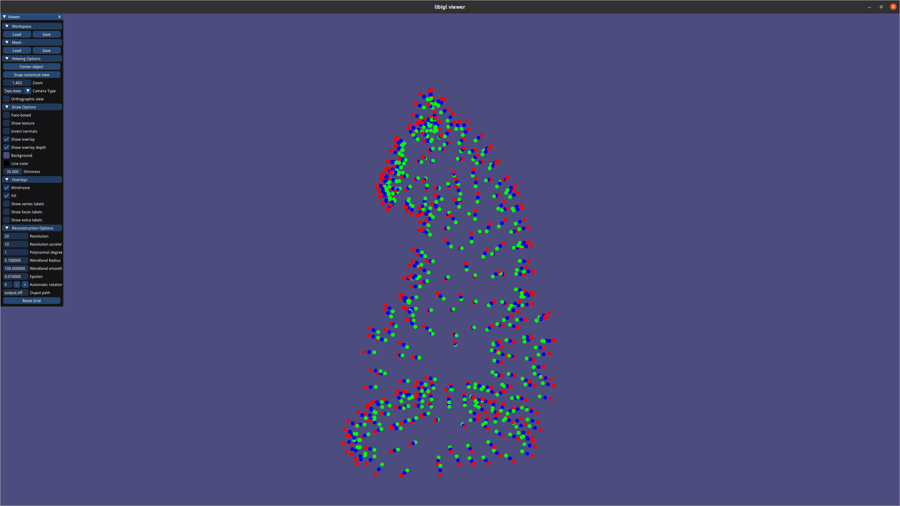
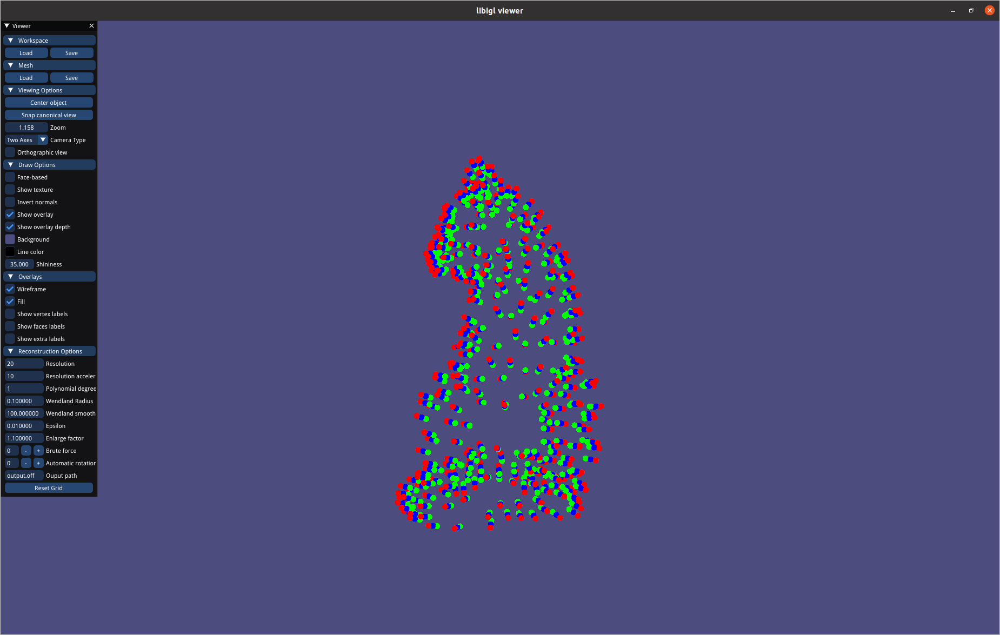

# Assignment 2
Name: 'François Costa'

Legi-Nr: '19-931-989'

## Required results
Edit this 'README.md' file to report all your results. You only need to update the tables in the reports section by adding screenshots and reporting results.

### Tasks
1) Show the visualization of the constrained points for the 'cat.off' point cloud.

2) Show screenshots of the grid with nodes colored according to their implicit function values (cat.off and luigi.off).

3) Show screenshots of the reconstructed surfaces. Experiment with different parameter settings: grid resolution (also anisotropic in the 3 axes), Wendland function radius, polynomial degree. Add all these settings to the GUI to ease experimentation. Briefly summarize your observations and save the reconstructed models in the .off format for every point-cloud dataset provided (assignment2/results).

4) Theory question (1): Save your notes to assignment2/results and link to them from within the report.

5) Theory question (2): Save your notes to assignment2/results and link to them from within the report.

6) Show screenshots comparing the 'hound.off' computed with normal-based reconstruction to the point-based reconstruction of the previous task.

7) Compare your MLS reconstruction results to the surfaces obtained with RIMLS and Screened Poisson Reconstruction, and inspect the differences. Report your findings.

8) Show screenshots of your method for estimating normals based on Principal Component Analysis. Compare the results with the reconstruction obtained using the provided normals.

## Reports
### 1 - Visualization of the 'cat.off' point cloud with constrained points

All parameters that are used to generate the constraints are visible in the GUI of the images.

In the case where the nearest point isn't the original point, the user will get a warning.

| model name  | view 01                                                        | view 02                                                                     |
| :---------: |----------------------------------------------------------------|-----------------------------------------------------------------------------|
| cat         |  |  |

### 2 - Grid with nodes colored w.r.t. the implicit function (using the non-axis-aligned grid as described in Section 2.3) 

All parameters that are used to generate the grid are visible in the GUI of the images.

| model name  | view 01                                                           | view 02                                                            |
| :---------: |-------------------------------------------------------------------|--------------------------------------------------------------------|
| cat         |              |              |
| cat         |  |  |
| luigi      |           |            |

### 3 - Reconstructed surfaces
**Please also save the reconstructed shape (.off) in the results folder**

Reconstructed surface are done with the good parameters. Bad reconstructions are visible in the next section.

|                           sphere                            |                                    cat                                     |
|:-----------------------------------------------------------:|:--------------------------------------------------------------------------:| 
|  |                   |
|                            luigi                            |                                   horse                                    |
|  |                 |
|                            hound                            |                           cat (anisotropic grid)                           |
|   |  |

**Please summarize your observations of what happens when you change the following parameters. Please feel free to add screenshots (by creating a separate table) to illustrate your explanation.** 

(All figures are being generated with an enlarging factor of 1,1)

| params                   | Your Observation                                                                                                                                                                                                                                                                                                                                                                                                                                                                                                                                                                                                                                                                                                                                                                                                                                                                                                                                                                                                     | 
| :---------------------:  |----------------------------------------------------------------------------------------------------------------------------------------------------------------------------------------------------------------------------------------------------------------------------------------------------------------------------------------------------------------------------------------------------------------------------------------------------------------------------------------------------------------------------------------------------------------------------------------------------------------------------------------------------------------------------------------------------------------------------------------------------------------------------------------------------------------------------------------------------------------------------------------------------------------------------------------------------------------------------------------------------------------------|
| grid resolution          | As the resolution of the grid increases, the reconstruction becomes more and more accurate. This makes sense, since increasing the resolution means approximating the sdf with greater accuracy.  In the end, the grid is just a way to approximate the signed distance function. And so this finding is logical.  Of course the computing time is a bit bigger as well.                                                                                                                                                                                                                                                                                                                                                                                                                                                                                                                                                                                                                                             |
| Wendland function radius | A first observation is that the smaller the radius, the faster the calculation time. This is due to two things. Firstly, we can increase the resolution of the acceleration grid, which means that we will be comparing fewer points. As we have fewer points, the system of equations to be solved is also much smaller and therefore faster to solve. On the other hand, having a radius that is too small can lead to holes in the figure or even to a surface that is only partially reconstructed with occasional triangles and of course no continuity between these few triangles. On the other hand, having a radius that is too large results in a figure that does not look like much.                                                                                                                                                                                                                                                                                                                     |
| polynomial degree        | Increasing the degree of the polynomial had two effects on the meshes I could generate. Firstly, you can see that the cat is generated as if with a sort of "layers" with a polynomial of degree 0. You can see that the generation has several slices and this is not the most realistic rendering or the one that corresponds to the cloud point. If we increase the degree to 1 or 2, we have less of this effect with layers. This will result in a much more realistic generation. On the other hand, we have a second effect that appears when we increase the degree of the polynomial. We see very clearly the presence of lots of small cubes that increase. This also makes sense because we leave more degrees of freedom and the presence of overfits is therefore possible. Removing these small cubes should not be something very difficult for a post-processing pipeline. We can simply remove for example all surfaces with a diagonal smaller than 80% of the bounding box. This is just one idea. |
| Acceleration resolution | For the question of the resolution of the acceleration grid, the program analyses the 27 cells which form the grid where the point is and the neighbours. I am therefore able to set a good grid size at the time of use. I decided for the assignments to set up manually the grid of the acceleration resolution. That worked well in practice.                                                                                                                                                                                                                                                                                                                                                                                                                                                                                                                                                                                                                                                                    |
| Smoothing factor | For most meshes, the smoothing factor is around 150 and this is what empirically gave me the best results. However I generated luigi with a smoothing factor of 10.                                                                                                                                                                                                                                                                                                                                                                                                                                                                                                                                                                                                                                                                                                                                                                                                                                                  |

|                    Grid resolution 10                    |                      Grid resolution 20                      |                      Grid resolution 30                      |                      Grid resolution 50                      |
|:--------------------------------------------------------:|:------------------------------------------------------------:|:------------------------------------------------------------:|:------------------------------------------------------------:|
|  |  |  |  |

|                    Wendland radius 0.1                    |                    Wendland radius 0.05                    |                   Wendland radius 0.025                   |                   Wendland radius 0.01                   |                    Wendland radius 0.005                    |
|:---------------------------------------------------------:|:----------------------------------------------------------:|:---------------------------------------------------------:|:--------------------------------------------------------:|:-----------------------------------------------------------:|
|  |  |  | |  |

|                      Degree 0                       |                      Degree 1                       |                      Degree 2                       |
|:---------------------------------------------------:|:---------------------------------------------------:|:---------------------------------------------------:|
|  |  |  |

**Please compare the computation time for constraints computation and MLS using brute force and a spatial index. Use hound.off for the comparison and use the same parameters for the timings with and without use of spatial index (please report the parameters that you used).**
| step                    | brute force  (avg of 5 runs)       |  spatial index    (avg of 5 runs)  | Conclusion |
| :---------------------: | :-----------------: | :-----------------: |  :-----------------: |
| constraints             |   0.068s             |   0.096s      | Difference is negligible |
| MLS                     |   183s              |    0.677s      | 270x speedup |

Parameter used for the generation

|        Parameter        | Value |
|:-----------------------:|:-----:|
|       Resolution        |  20   | 
| Resolution acceleration |  40   |
|    Polynomial degree    |   1   | 
|     Wendland radius     | 0.025 |
| Wendland smooth factor  |  100  | 
|         Epsilon         | 0.01  |
|   Enlarge factor grid   |  1.1  |

### 4 - Theory Question 1

**Prove that the normal of a surface defined by an implicit function is proportional to its gradient.**

|                      page1                      | 
|:-----------------------------------------------:|
|  |

### 5 - Theory Question 2

**Compute the closed-form gradient of the MLS approximation.**

Please show your answer in screenshot/photos (or link to a PDF). Make sure your answer is readable. You can add more pages by modifying the table.

|                      page1                      | 
|:-----------------------------------------------:|
|  |

### 6 - Normal-based v.s. point-based reconstruction ("hound.off")
| method       | view 01                                                          | view 02                                                           |
| :---------:  |------------------------------------------------------------------|-------------------------------------------------------------------|
| point-based  |  |  |
| normal-based |     |       |

| method | Point based                                                    | Normal based                                               | 
|:------:|----------------------------------------------------------------|------------------------------------------------------------|
| View 1 |  |  |
| View 2 |      |      |

|  method  | Point based                                                                                                                                                           | Normal based                                                                                                                                                                                                                                                                                                                                                                                         | 
|:--------:|-----------------------------------------------------------------------------------------------------------------------------------------------------------------------|------------------------------------------------------------------------------------------------------------------------------------------------------------------------------------------------------------------------------------------------------------------------------------------------------------------------------------------------------------------------------------------------------|
| Technique | We use MLS and blend between constant values associated with the polygon.                                                                                             | We use MLS and blend between prescribed function associated with the polygon. The goal of this paper is to reduce some ossicliations effects that can appear. We can extract the following quote from the paper: The additional constraints influence the function’s gradient only crudely, and they can cause undesirable oscillatory behavior as the evaluation point moves away from the surface. |
| Comments for the hound image | This is the version of the cat with point constraint. You can see that this oscilliation effect is present. Of course it is not as strong as on Luigi, but it is there. | Using the normals to interpolate, we see that the result is better and that some ossicliations have disappeared.                                                                                                                                                                                                                                                                                     |
| Comments for the luigi image | We can see in this case that the "layers" present in the image shows the oscilliation effect.                                                                         | In the case of using this function approximation we see that the oscilliation effect decreases drastically.                                                                                                                                                                                                                                                                                          |
### 7 - MLS v.s. Screened Poisson Reconstruction v.s. RIMLS

**No implementation required, you can use [Meshlab](https://www.meshlab.net) to perform the comparisons.**

| model names  |                           MLS                           |                                                                                                                                             Possion                                                                                                                                             |                                                                                                       RIMLS                                                                                                       | 
| :---------:  |:-------------------------------------------------------:|:-----------------------------------------------------------------------------------------------------------------------------------------------------------------------------------------------------------------------------------------------------------------------------------------------:|:-----------------------------------------------------------------------------------------------------------------------------------------------------------------------------------------------------------------:|
| cat          |          |                                                                                                                                                                                                                                             |                                                                                                                                                                 |
| luigi        |        |                                                                                                                                                                                                                                           |                                                                                                                                                               |
| optimization technique        |                         Use MLS                         |                                                                                                            Use a scalar functions, whose gradient approximates best the vector field                                                                                                            |                                                       Use an estimator which is robust to outliers. Iterative method. The method uses nonlinear regression.                                                       |
| comments        | This is the mesh reconstructed with MLS for comparaison | Poisson reconstruction has the property to create a watertight mesh. We can clearly see that it is the case here. Also we don't have the presence of noise. In the baseline, we had to find good parameters and to avoid noise. Also we don't have the "layers" like in the MLS reconstruction. | The resulting approximation is very smooth compared to the MLS baseline. In general this method is good at preserving sharp features. However, we can see at the boundary that the reconstruction is a bit noisy. |

### 8 - PCA normals v.s. provided normals (luigi.off)

| model names |                                                          PCA normals                                                          |                                                                                                                                                                                                                                                                                                                                                                                                                       Provided normals                                                                                                                                                                                                                                                                                                                                                                                                                        | 
|:-----------:|:-----------------------------------------------------------------------------------------------------------------------------:|:-------------------------------------------------------------------------------------------------------------------------------------------------------------------------------------------------------------------------------------------------------------------------------------------------------------------------------------------------------------------------------------------------------------------------------------------------------------------------------------------------------------------------------------------------------------------------------------------------------------------------------------------------------------------------------------------------------------------------------------------------------------------------------------------------------------------------------------------------------------:|
|   sphere    |                                                                    |                                                                                                                                                                                                                                                                                                                                                                                                                                                                                                                                                                                                                                                                                                                                                                                               |
|     cat     |                                                                       |                                                                                                                                                                                                                                                                                                                                                                                                                                                                                                                                                                                                                                                                                                                                                                                                  |
|    luigi    |                                                                     |                                                                                                                                                                                                                                                                                                                                                                                                                                                                                                                                                                                                                                                                                                                                                                                                |

|  |                                                       Provided normals                                                        |                                                                                                                                                                                                                                                                                                                                                                                                                           PCA normals                                                                                                                                                                                                                                                                                                                                                                                                                            | 
|:-----------:|:-----------------------------------------------------------------------------------------------------------------------------:|:----------------------------------------------------------------------------------------------------------------------------------------------------------------------------------------------------------------------------------------------------------------------------------------------------------------------------------------------------------------------------------------------------------------------------------------------------------------------------------------------------------------------------------------------------------------------------------------------------------------------------------------------------------------------------------------------------------------------------------------------------------------------------------------------------------------------------------------------------------------:|
|  comments   | The normals are the baseline or the true normals. In a sense they are "perfect" and the goal of pca is to approximate a them. | To approximate the normals of the mesh, we look in a first plane for the points in the neighbourhood of the point we wish to approximate. Then we approximate the tangent plane and the normals to this plane using PCA. The two eigenvectors with the largest eigenvalues correspond to the tangent plane and the eigenvector with the smallest value corresponds to the normal vector. We can still orient this vector in the right direction by using the normal vector which is given as input. Of course the results of the approximation are a little less good than the original normals. This is logical, a function that approximates another one can never be as good as the first one. We can see that the approximation of the normals works very well where the cloud point is relatively flat and that the results are a bit worse in the corners. |
