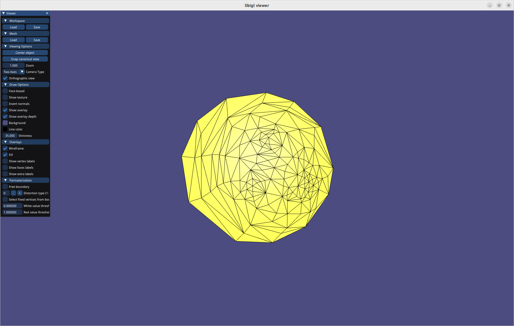
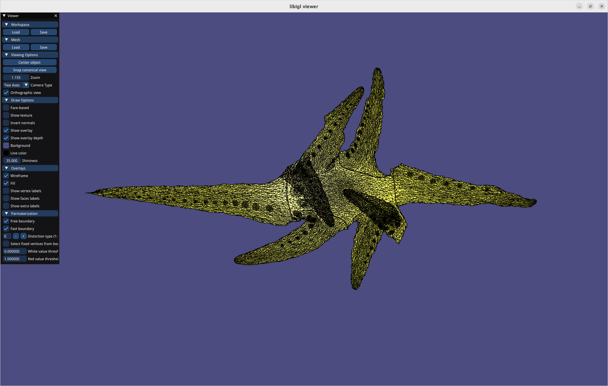
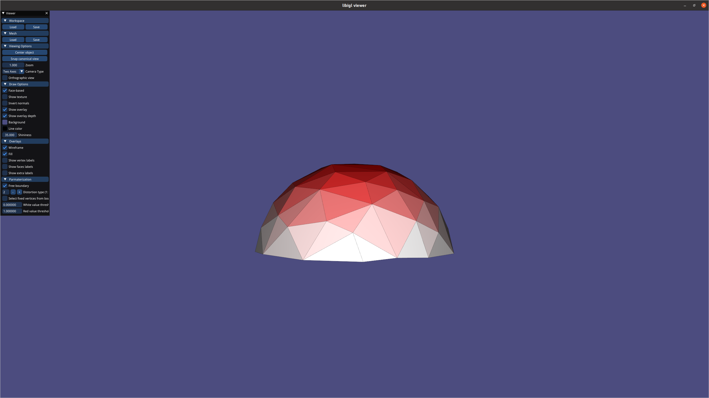

# Assignment 4

Name: François Costa

Legi-Nr: 19-931-989

## Required results
Edit this 'README.md' file to report all your results. You only need to update the tables in the reports section by adding screenshots and reporting results.

### Mandatory Tasks

1) Screenshots of the parameterizations and textured (checkerboard) models for all the implemented methods and boundary conditions (models: cathead.obj, hemisphere.off, hemisphere_non_convex_boundary.off, Octo_cut2.obj)

2) Several examples of the distortion visualizations.


## Reports

## The code was compiled with cpp17!

This line needs to be added in the cmake file.

```cmake
target_compile_features(${PROJECT_NAME} PUBLIC cxx_std_17)
```

### (mandatory-1) parameterization and checkerboard texture models
#### cathead
| Method            | checkerboard textured models          | Parameterization                                     |
| :--------------:  | ------------------------------------- |------------------------------------------------------|
| Uniform (fixed)   ||  |
| Cotangent (fixed) ||  |
| LSCM (fixed)      ||  |
| ARAP (fixed)      ||  |
| LSCM (free)       ||  |
| ARAP (free)       ||  |

#### hemisphere
| Method            | checkerboard textured models          | Parameterization                                        |
| :--------------:  | ------------------------------------- |---------------------------------------------------------|
| Uniform (fixed)   ||  |
| Cotangent (fixed) ||  |
| LSCM (fixed)      ||  |
| ARAP (fixed)      ||  |
| LSCM (free)       ||  |
| ARAP (free)       ||  |


#### hemisphere_non_convex_boundary
| Method            | checkerboard textured models          | Parameterization                                                   |
| :--------------:  | ------------------------------------- |--------------------------------------------------------------------|
| Uniform (fixed)   ||  |
| Cotangent (fixed) ||  |
| LSCM (fixed)      ||  |
| ARAP (fixed)      ||  |
| LSCM (free)       ||  |
| ARAP (free)       ||  |

#### Octo_cut2
| Method            | checkerboard textured models          | Parameterization                                      |
| :--------------:  | ------------------------------------- |-------------------------------------------------------|
| Uniform (fixed)   ||  |
| Cotangent (fixed) ||  |
| LSCM (fixed)      ||  |
| ARAP (fixed)      ||  |
| LSCM (free)       ||  |
| ARAP (free)       ||  |


### (mandatory-2) distortion visualization
#### cathead
|     mtd \ metric     | Conformal (angle)                                                     | Authalic (area)                                                       | Isometric  (length)                                                   |
|:--------------------:|-----------------------------------------------------------------------|-----------------------------------------------------------------------|-----------------------------------------------------------------------|
| LSCM (free) - View 1 |             |             |             |
| LSCM (free) - View 2 |             |             |             |
| ARAP (free) - View 1 |  |  |  |
| ARAP (free) - View 2 |  |  |  |


#### hemisphere

| mtd \ metric      | Conformal (angle) |    Authalic (area)  |  Isometric  (length)    |
| :--------------:  | ----------------- | ------------------- | ----------------------- |
| LSCM (free)       |      |      |      | 
| ARAP (free)       | | ||


