# Assignment 6: Skinning & Skeletal Animation

Name: François Costa

Legi-Nr: 19-939-989


## Required results
Edit this 'README.md' file to report all your results. Use the ```/res``` folder to store your results.

### Tasks

1. Read Sec. 1 carefully to get familar with the data format, problem formulation, and mathematical background.
2. (Task 2) two theoretical discussions 
3. (Task 3) visualize the animation of the input skeleton of the hand shape from two types of rotations (rotation matrices and quaternions)
4. (Task 4) compute harmonic skinning weights on selected handles
5. (Task 5) per-vertex LBS + rotation/translation + Lerp
6. (Task 6) per-vertex LBS + dual quaternion + Nlerp
7. (Task 7) per-face LBS + quaternion + Slerp + Poisson Stitching
8. (Task 8.1) context-aware per-vertex LBS
9. (optional Task 8.2) context-aware per-face LBS
 
### Important Note
1. We do not provide template code for this assignment - feel free to use previous template code if you want
2. You can use any libigl functions (and other open-source code, but please add a reference in this case)
3. You are allowed to use your previous code (for example, you will find the Poisson Stitching technqiue quite similar to Deformation Transfer that you have implemented in Assignment 5; and also the provided handle selection in A5 might inspire you to design your handle selection tool in Task 4).
4. You are allowed to modify this report freely (but please try to stick to some table format of orangizing figures to avoid a 20-page long report)
5. Please feel free to try other skeletal animation/deformation data you can find online if you find the provided animation is not cool enough (for example [here](https://www.mixamo.com/#/), but note that they might be in different data format than the provide ones).
6. Please try to keep your code clean and self-explained (with necessary comments), since we will grade this assignment based on your code as well (~~please don't feel upset when you get bad animations, you can always blame our poor data preparation~~).

## How to run the code

#### Run the hand (tasks 3-7)

```bash
make -w -j 16 && ./assignment6 hand
```

### Run the body with per vertex displacement (task 8.1)

```bash
make -w -j 16 && ./assignment6 body
```

### Run the body with per face displacement (task 8.2 )

```bash
make -w -j 16 && ./assignment6 face
```

## Reports

### Task 2: Rotation Representation discussion
#### Task 2.1. compare different rotation representations

| Representions        |  Short Description  |                                                                                                                                                  pros                                                                                                                                                   |                                                                                                                                                                  cons                                                                                                                                                                   |
| :------------------: |:------------------: |:-------------------------------------------------------------------------------------------------------------------------------------------------------------------------------------------------------------------------------------------------------------------------------------------------------:|:---------------------------------------------------------------------------------------------------------------------------------------------------------------------------------------------------------------------------------------------------------------------------------------------------------------------------------------:|
| rotation matrix      |The transformation can be encoded effectively through a basic linear matrix-vector multiplication. In this case, we utilize a 3x3 matrix. It's important to note that this matrix multiplication does not commute, meaning the order of multiplication matters.        |                                                                                                                                         This method is widely recognized and highly familiar. Numerous algorithms have been extensively tested using rotation matrices, making it almost a standard practice to utilize them for performing rotations.                                                 |                                                                                                                      Rotation matrices exhibit four distinct issues. Firstly, they possess 12 degrees of freedom for a rotation, despite only requiring 6 degrees of freedom. This inefficiency can result in memory wastage. Secondly, interpolating between matrices can prove to be a challenging task. Additionally, visualizing a rotation matrix is not straightforward. Lastly, using matrices for rotation can introduce undesired scaling and shearing effects.                                                                                                                                                            |
| euler angles         | Euler angles are a way to describe the rotation or orientation of an object in three-dimensional space. <br/>They involve three angles that represent successive rotations around different axes. These angles are typically referred to as yaw, pitch, and roll or rotation around the X, Y, and Z axes. By applying these rotations in a specific order, the final orientation of the object can be determined. Euler angles are commonly used in various fields like computer graphics, robotics, and aerospace engineering to represent and manipulate 3D rotations.          | Euler angles offer a straightforward and intuitive understanding. They boast a substantial historical presence in physics and computer graphics, resulting in a wealth of literature available on the subject. Additionally, Euler angles enable the straightforward integration of certain quantities. | Euler angles have two disadvantages. Firstly, as other angles pass through a singularity, the angles themselves can undergo sudden changes of up to 2 pi radians. Secondly, there are a total of 12 possible angle rotation sequences, and there is no definitive "correct" sequence among them. They also suffer from the gimbal lock. |
| axis angle           | The axis-angle is expressed as a pair of a unit axis (n) and an angle (gamma). This representation can be easily transformed into a matrix and vice versa. However, it is challenging to directly combine the axis-angle elements in their original form. Typically, they are converted into an alternative representation, such as matrices or quaternions, before they can be concatenated together.             |                                                                                         The transformation is remarkably intuitive and can be easily visualized. It involves rotating around a specific axis. As humans, we possess the ability to visualize it effortlessly.                                                                                          |           Linearly interpolating between two axis representations is not a straightforward task. Naive interpolation does not provide the shortest path between them. Additionally, interpolating the angle can result in discontinuity specifically between 0 and 2 pi, leading to undesired "jumps" in the representation.            |
| quaternions          | A quaternion is a mathematical entity that extends the concept of complex numbers to four dimensions. It is represented as a four-element vector, typically denoted as (w, x, y, z), where 'w' represents the scalar part and 'x', 'y', and 'z' represent the vector or imaginary components. Quaternions are primarily used for representing rotations and orientations in three-dimensional space.   Quaternions can be viewed as an extension of complex numbers, where instead of using 'i', they introduce 'i', 'j', and 'k'. These three components satisfy the property that 'j^2 = k^2 = i^2 = -1', similar to how 'i^2 = -1' in complex numbers.        |                                                           Quaternions eliminate the Gimbal Lock effect, ensuring a stable representation of rotations. Interpolation between two quaternions yields smooth transitions. Moreover, quaternions provide superior numerical stability compared to other representations, making them suitable for precise applications. Quaternion operations can be performed efficiently, allowing for quick computations.                                                                                                                 |                                                                                                                                       Quaternions possess several notable disadvantages. Firstly, they are inherently complex and can be challenging to comprehend. Their usage and understanding may not come intuitively to humans. Additionally, working with quaternions often incurs a conversion overhead when transitioning between quaternion representations and other formats.                                                                                                                              |

#### Task 2.2. Theoretical question for dual quaternions

| Euler angles -> rotation  matrix |                                                                                                                                                                                      rotation matrix -> quaternion                                                                                                                                                                                       |                                                                                                                                                                                                 quaternion + translation -> dual quaternion                                                                                                                                                                                                 |
| :------------------------------: |:--------------------------------------------------------------------------------------------------------------------------------------------------------------------------------------------------------------------------------------------------------------------------------------------------------------------------------------------------------------------------------------------------------:|:-------------------------------------------------------------------------------------------------------------------------------------------------------------------------------------------------------------------------------------------------------------------------------------------------------------------------------------------------------------------------------------------------------------------------------------------:|
| To obtain a rotation matrix from Euler angles, we can multiply the matrices Rx, Ry, and Rz together. It is crucial to remember that matrix multiplication is not commutative. Therefore, the multiplication of Rx, Ry, and Rz matrices must be performed in a specific order.                          | We cam compute the components of the quaternion from the rotation matrix using the formulas from this link [Rotation matrix to quaternion](https://en.wikipedia.org/wiki/Rotation_formalisms_in_three_dimensions#Rotation_matrix_%E2%86%94_quaternion). Note that they are multiple way to perform the conversion. Mathematically they are the same, but in practice the numerical stability can change. | According to the section 7 of [this paper](https://cs.gmu.edu/~jmlien/teaching/cs451/uploads/Main/dual-quaternion.pdf), we can convert a quaternion and a translation vector using a method equivalent to the definition given in the section 7.1. The real quaternion is the rotation one. The dual quaternion is 0.5 multiplied by the "translation quaternion" and the rotation quaternion.We encode the translation like this (0,x,y,z) | 


Pseudo code for Quaternion + translation -> dual quaternion

```C
QuaternionTranslationToDualQuaternion(Quaternion r, Vector3 t)
{
 real = Quaternion.Normalize(r);
 dual = 0.5f * Quaternion(t,0) * m_real;
}
```

### Task 3: animation of the skeleton
|                        from rotaton matrix                         |                           from quaternions                           |
|:------------------------------------------------------------------:|:--------------------------------------------------------------------:|
| 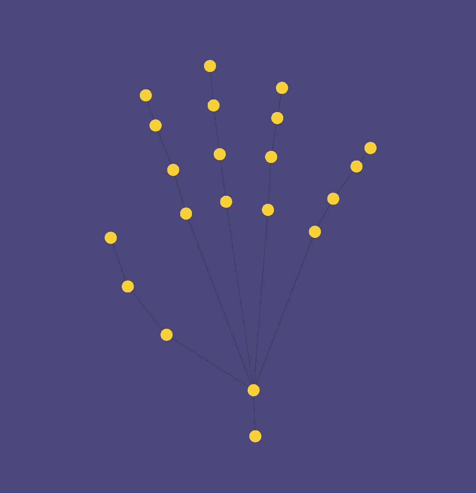 | 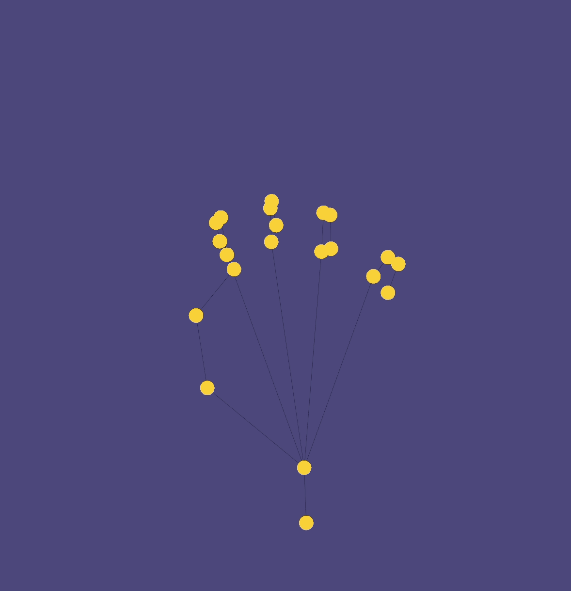 |

### Task 4: computing harmonic skinning weights on selected handles

I choose the handles in the following manner. The process of selection is completely automated. To do this, I calculate the midpoint between the two endpoints for each bone. Then, I choose the x elements that are closest to the midpoint.

Additionally, I make the following assumption: no vertex is present in the x closest elements of two edges. If such a situation occurs, only one vertex will be selected in an unspecified manner. Although the program will not crash due to this, the selection will be arbitrary and there is no guarantee for the user.

Moreover, I utilize the "nth_element" function to achieve faster results. Sorting the elements would be slower in comparison. 

This method could be a bit less precise that the one mentioned in the report, but it has a big advantage. We don't have to completely sort the mesh.

#### Task 4.1. handle selection
| shape name           |                         joint 1                          |                         joint 2                          |                         joint 3                         |
| :------------------: |:--------------------------------------------------------:|:--------------------------------------------------------:|:-------------------------------------------------------:|
| hand |  | 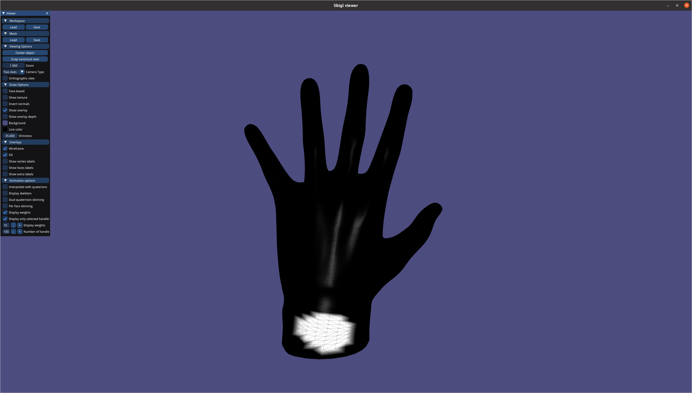 |      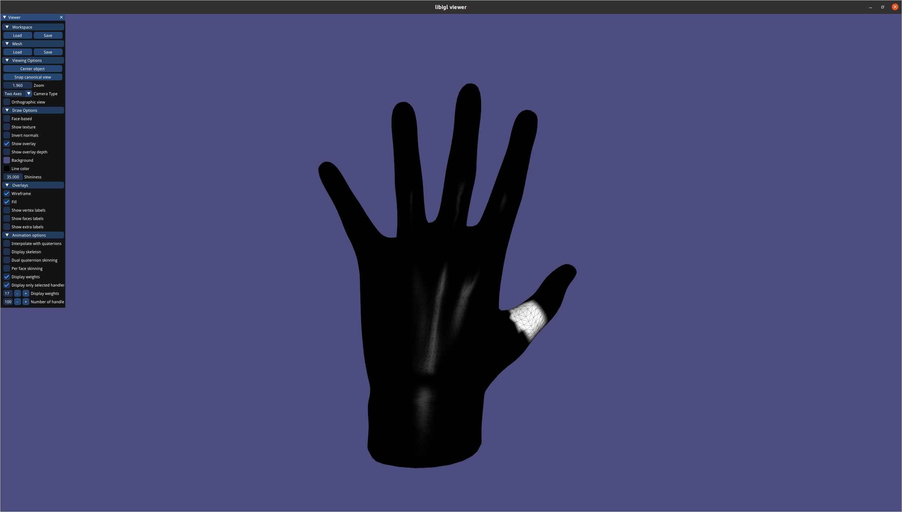       |


#### Task 4.2. skinning weights visualization
| shape name           |                         joint 1                          |                         joint 2                          |                         joint 3                          |
| :------------------: |:--------------------------------------------------------:|:--------------------------------------------------------:|:--------------------------------------------------------:|
| hand | 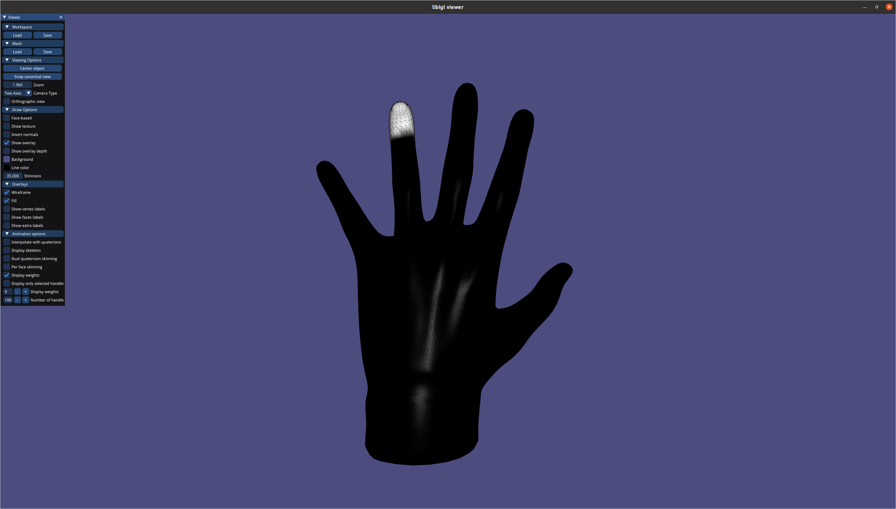 | 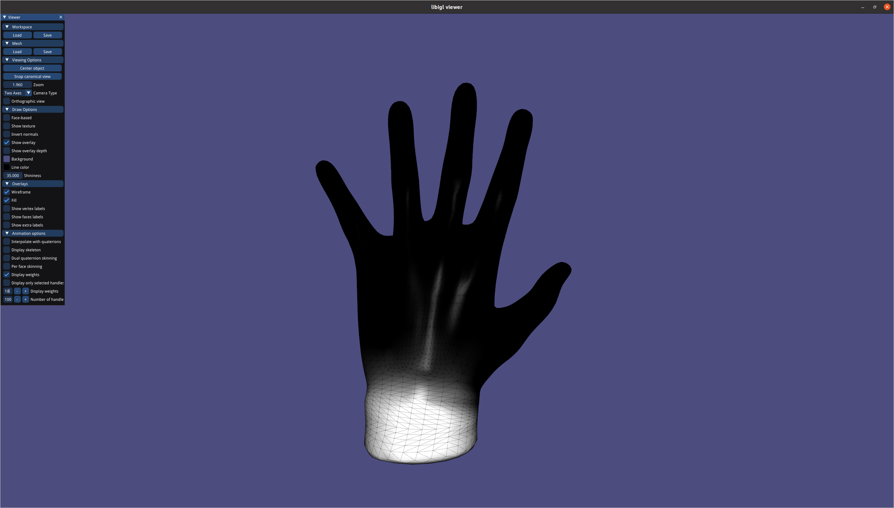 | 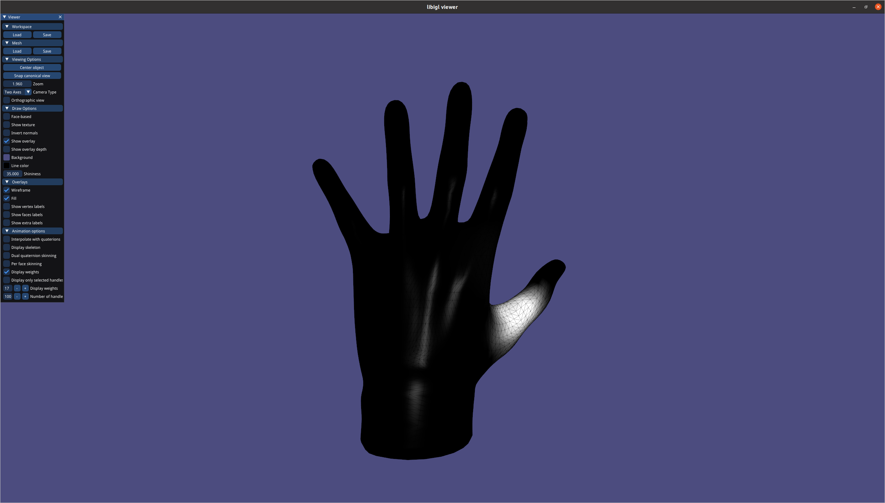 |

### Task 5/6/7: skeletal animation 
|              Task 5: per-vertex + rotation + Lerp               |                   Task 6: per-vertex + quaternion + Nlerp                   |                Task 7: per-face + quaternion + Slerp                 |
|:---------------------------------------------------------------:|:---------------------------------------------------------------------------:|:--------------------------------------------------------------------:|
|  |  |  |

|              Task 5: per-vertex + rotation + Lerp               |                   Task 6: per-vertex + quaternion + Nlerp                   |                Task 7: per-face + quaternion + Slerp                 |
|:---------------------------------------------------------------:|:---------------------------------------------------------------------------:|:--------------------------------------------------------------------:|
| This is the basic way to animate a mesh. We use linear blend skinning only. Every point is transformed and given a weight based on its importance in that space. As we can see if we zoom on the fingers,  there is an issue known as the "candy-wrapper effect" in this implementation. It's a common problem in linear blend skinning and considered an infamous artifact. Also we have some self intersections at the end of the animations. I will now compare this animation with the other two animations. |In this case, we are using dual quaternions and Nlerp for interpolation. If we zoom in on the fingers, we will notice that they appear slightly larger. This is because the candy wrapper effect, which is commonly seen in linear blend skinning, has disappeared. The overall volume of the figure also seems slightly bigger. Apart from these changes, both animations are quite similar, and I don't notice any other significant differences.      |      For this version, we have adopted a completely different approach. We are now on a per face paradigm where we solve a linear system of equations and apply Poisson post-processing. This technique has effectively eliminated the self-intersections that were present in the previous animation. As a result, we can clearly observe that the hand appears a bit larger, and the animation is smoother. The differences we observe are consistent with those seen in Assignment 5 involving local displacements. Unlike linear blend skinning, we do not encounter any self-intersections in this approach.      |


### Task 8.1: context-aware per-vertex LBS
#### Task 8.1.1 visualize the unposed example shapes
| shape name           |                    unpose 1                    |                    unpose 2                    |                    unpose 3                    |                     unpose 4                     |
| :------------------: |:----------------------------------------------:|:----------------------------------------------:|:----------------------------------------------:|:----------------------------------------------:|
| human | 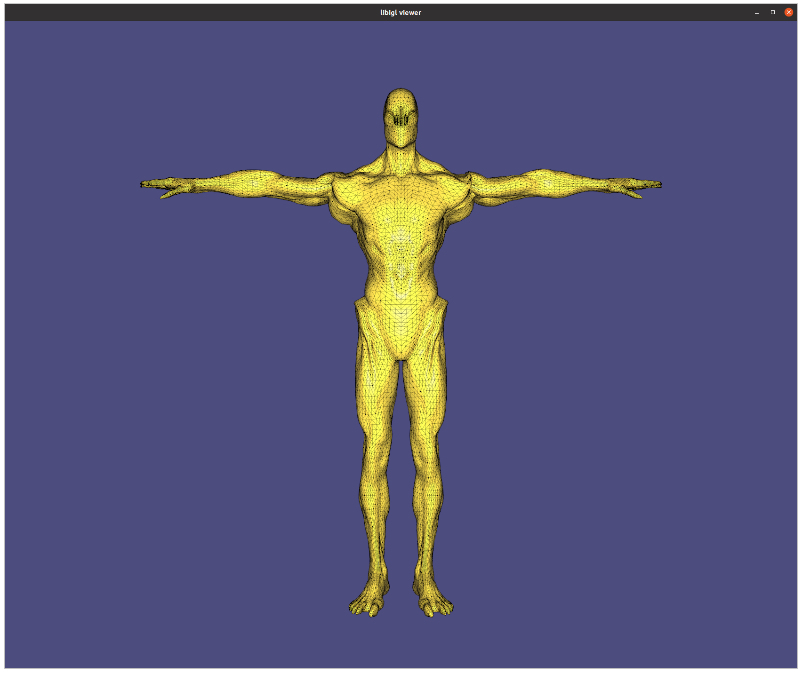 | 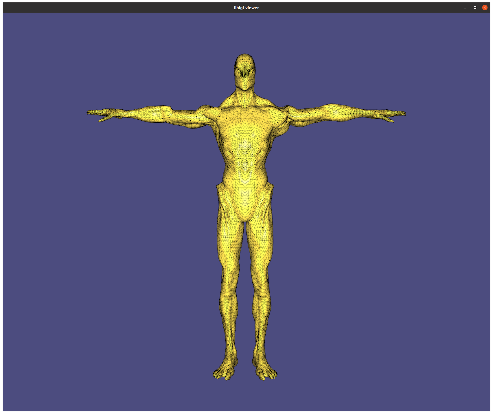 | 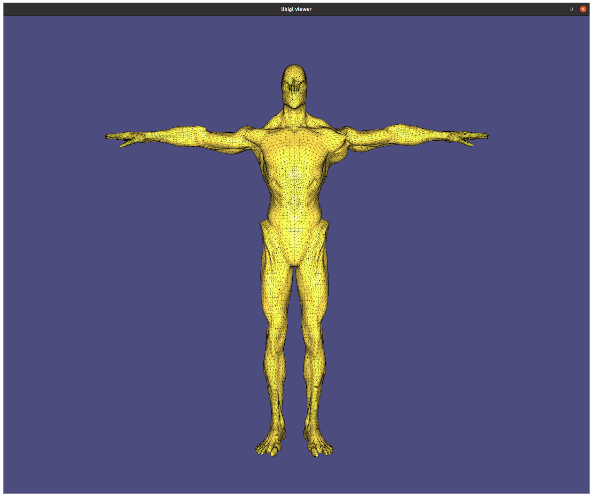 | 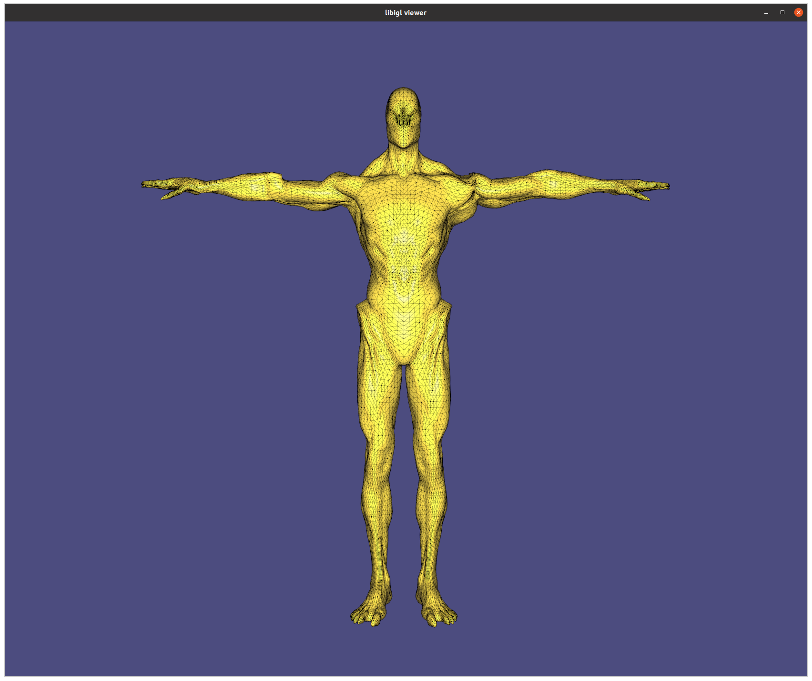 | 

#### Task 8.1.2 skeletal animition using context

|                                 without context                                  |                                                                                                                                                      with context                                                                                                                                                       | 
|:--------------------------------------------------------------------------------:|:-----------------------------------------------------------------------------------------------------------------------------------------------------------------------------------------------------------------------------------------------------------------------------------------------------------------------:|  
|                                  |                                                                                                                                                                                                                                                                |  

|                                 without context                                  |                                                                                                                                                                                                                                                                with context                                                                                                                                                                                                                                                                | 
|:--------------------------------------------------------------------------------:|:------------------------------------------------------------------------------------------------------------------------------------------------------------------------------------------------------------------------------------------------------------------------------------------------------------------------------------------------------------------------------------------------------------------------------------------------------------------------------------------------------------------------------------------:|  
| This is the animated figure using lbs. As usual it suffers from the same issues. | This animation has been created with context aware pose from the figure. As we observe, the mesh quality has noticeably improved this time. There is no room for any ambiguity or multiple interpretations. The shoulder has been rendered with enhanced visual appeal, and the same can be said for the elbow as well. The self intersection are clearly less visible in the shoulder. Modifying the value of the hyper parameter in the RBF functions gave different results. The animation was always "correct" but visually different. |

### Task 8.2: context-aware per-face LBS

#### Task 8.1.1 visualize the unposed example shapes
| shape name           |                      unpose 1                       |                      unpose 2                       |                      unpose 3                       |                      unpose 4                       |
| :------------------: |:---------------------------------------------------:|:---------------------------------------------------:|:---------------------------------------------------:|:---------------------------------------------------:|
| human | 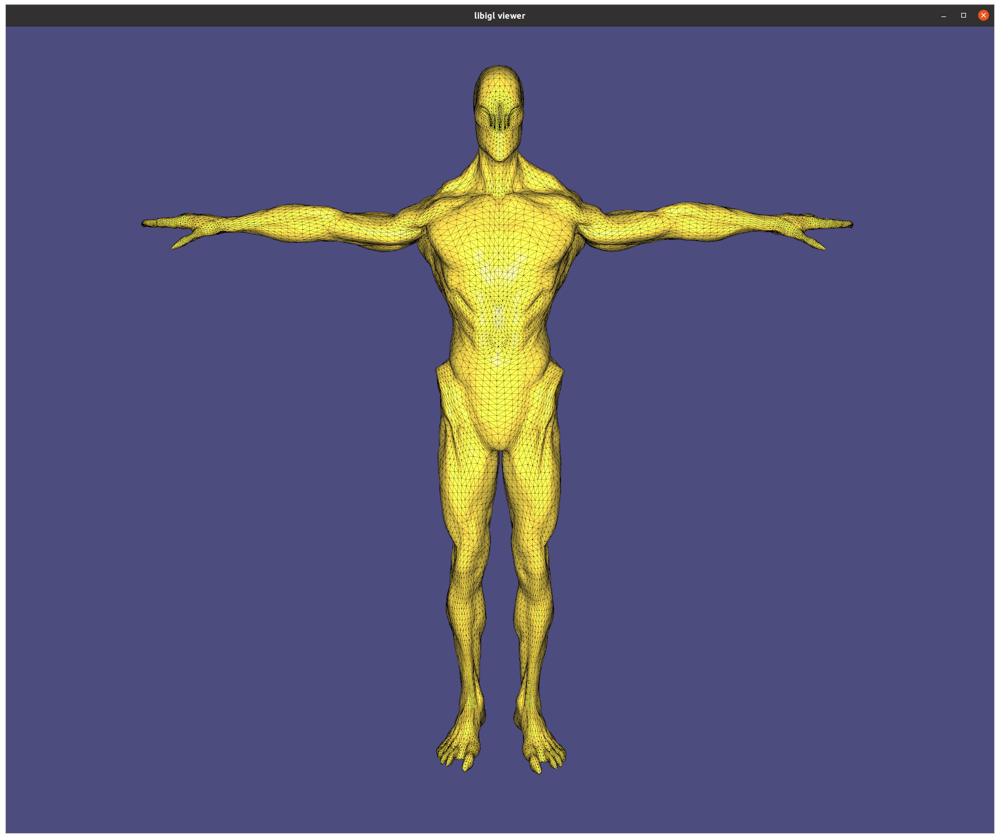 | 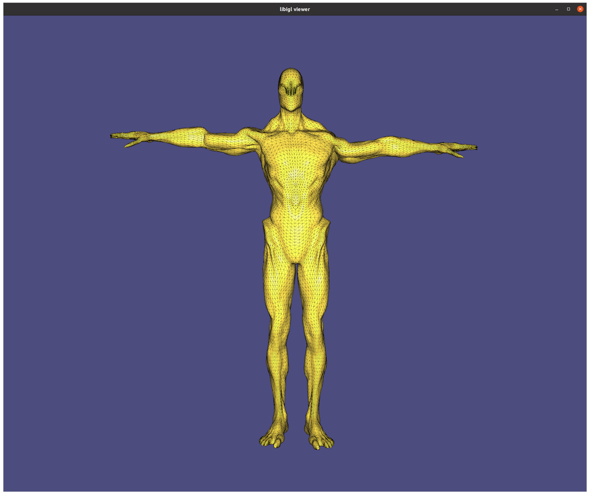 | 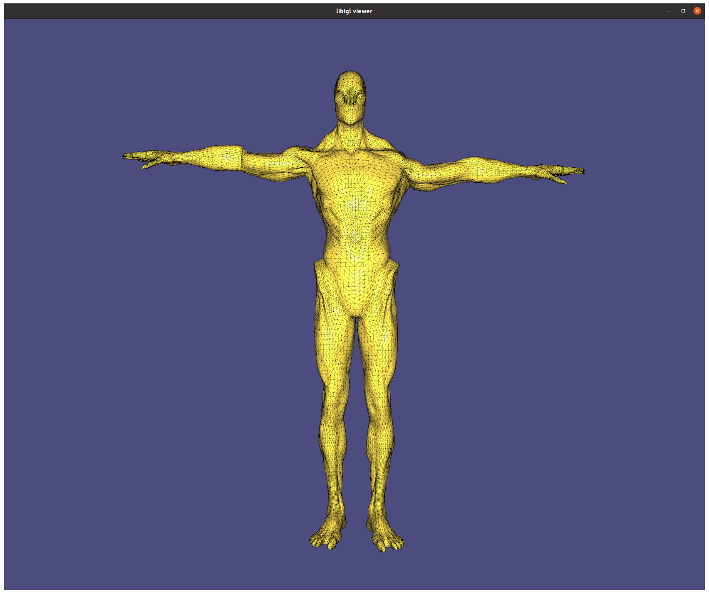 | 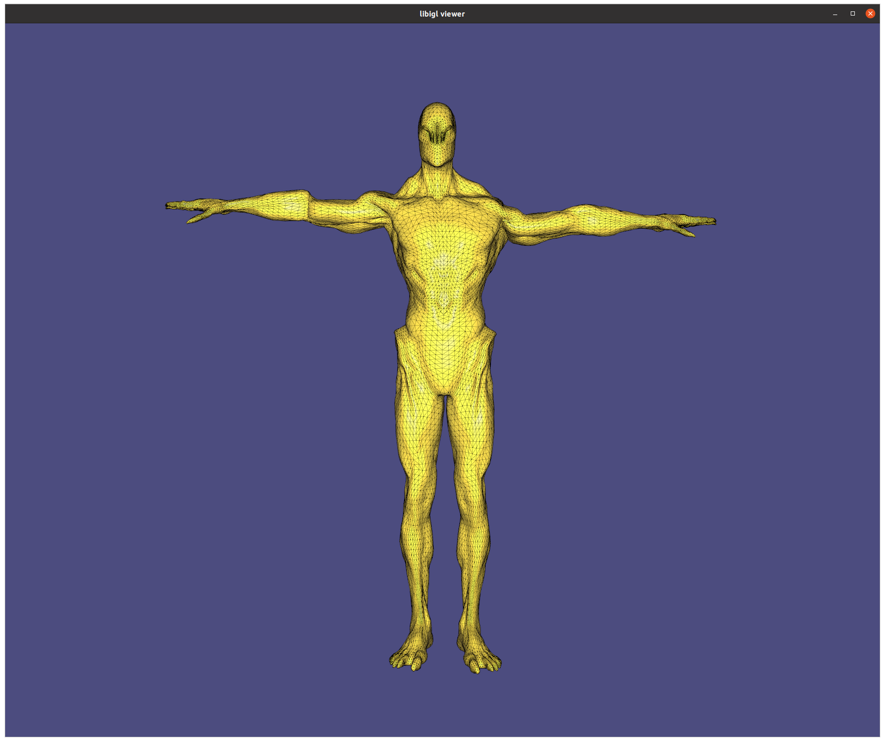 | 

#### Task 8.1.2 skeletal animition using per face context

|                        without context                         |          per face context with equation 9           |          per face context with equation 10           |
|:--------------------------------------------------------------:|:---------------------------------------------------:|:----------------------------------------------------:| 
|  |  |  |  

|                                                                                                         without context                                                                                                          |          per face context with equation 9           |                                                                                                                                                                                                                per face context with equation 10                                                                                                                                                                                                                 |                                                                                                                                                                                                                                                                                                                                                                                                                                                                           Comparaison with the previous exercice                                                                                                                                                                                                                                                                                                                                                                                                                                                                            |
|:--------------------------------------------------------------------------------------------------------------------------------------------------------------------------------------------------------------------------------:|:---------------------------------------------------:|:----------------------------------------------------------------------------------------------------------------------------------------------------------------------------------------------------------------------------------------------------------------------------------------------------------------------------------------------------------------------------------------------------------------------------------------------------------------:|:-------------------------------------------------------------------------------------------------------------------------------------------------------------------------------------------------------------------------------------------------------------------------------------------------------------------------------------------------------------------------------------------------------------------------------------------------------------------------------------------------------------------------------------------------------------------------------------------------------------------------------------------------------------------------------------------------------------------------------------------------------------------------------------------------------------------------------------------------------------------------------------------------------------------------------------------------------------------------------------------:| 
 | This animation is a straightforward implementation of the Poisson technique introduced in exercise 7. I use this animation as a baseline for comparing the displacements using equations 9 and 10, as well as the LBS technique. | Now, we will apply displacement by using equation 9 from the assignment. When we observe the animation, we can see that it closely resembles the original shape that was unposed. However, there is a drawback to this approach. The summation involved in equation 9 can result in artifacts due to the potential presence of rotational components in the unposed shape.| Now, we will apply displacement using equation number 10 from the assignment. This implementation is slightly more advanced than the previous one. The key difference is that we decompose the shape into its rotational and skew components. As a result, the output appears to be a combination or "blend" of the two previous animations. This can be observed in the width of the shoulder region, which visually seems to provide the most accurate result. | Let's compare the outcomes of the deformation performed on a per-vertex basis versus a per-face basis. These two approaches follow different paradigms. The first one involves computing the animation on a "per-vertex" level, while the second one operates on a "per-face" level. One noticeable aspect is the difference in computation speed. The per-vertex computation is faster and can achieve a higher frame rate compared to the per-face approach. This is because the per-face method involves more complex operations. Additionally, we can observe a variation in how the shoulder region is rendered in both approaches. In the per-vertex deformation, the shoulder appears slightly different compared to the per-face deformation. Specifically, in the per-face approach, the shoulder appears slightly brighter. Also another point is that the unpose are really similar. In general both results give good animation result. This is of course a subjective opinion. |